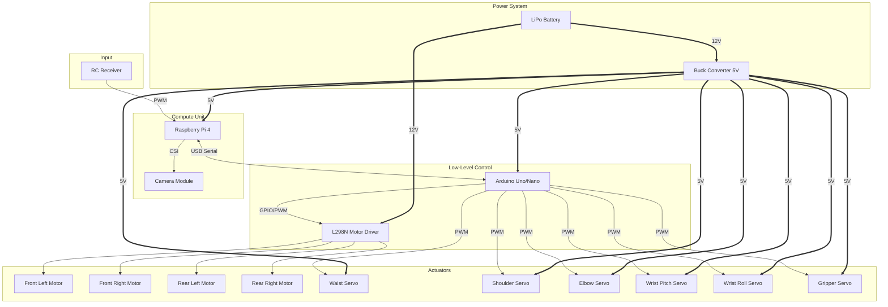

# Robot Hardware Architecture

```mermaid
graph TD
    subgraph Power [Power System]
        Battery[LiPo Battery]
        Buck[Buck Converter 5V]
    end

    subgraph Compute [Compute Unit]
        Pi[Raspberry Pi 4]
        Cam[Camera Module]
    end

    subgraph Control [Low-Level Control]
        Arduino[Arduino Uno/Nano]
        MotorDriver[L298N Motor Driver]
    end

    subgraph Actuators [Actuators]
        M1[Front Left Motor]
        M2[Front Right Motor]
        M3[Rear Left Motor]
        M4[Rear Right Motor]
        Servo1[Waist Servo]
        Servo2[Shoulder Servo]
        Servo3[Elbow Servo]
        Servo4[Wrist Pitch Servo]
        Servo5[Wrist Roll Servo]
        Servo6[Gripper Servo]
    end

    subgraph Input [Input]
        RC[RC Receiver]
    end

    %% Power Connections
    Battery ==>|12V| MotorDriver
    Battery ==>|12V| Buck
    Buck ==>|5V| Pi
    Buck ==>|5V| Arduino
    Buck ==>|5V| Servo1
    Buck ==>|5V| Servo2
    Buck ==>|5V| Servo3
    Buck ==>|5V| Servo4
    Buck ==>|5V| Servo5
    Buck ==>|5V| Servo6

    %% Data Connections
    Pi <-->|USB Serial| Arduino
    Pi -->|CSI| Cam
    RC -->|PWM| Pi

    %% Control Connections
    Arduino -->|PWM| Servo1
    Arduino -->|PWM| Servo2
    Arduino -->|PWM| Servo3
    Arduino -->|PWM| Servo4
    Arduino -->|PWM| Servo5
    Arduino -->|PWM| Servo6
    
    Arduino -->|GPIO/PWM| MotorDriver
    MotorDriver --> M1
    MotorDriver --> M2
    MotorDriver --> M3
    MotorDriver --> M4
```
