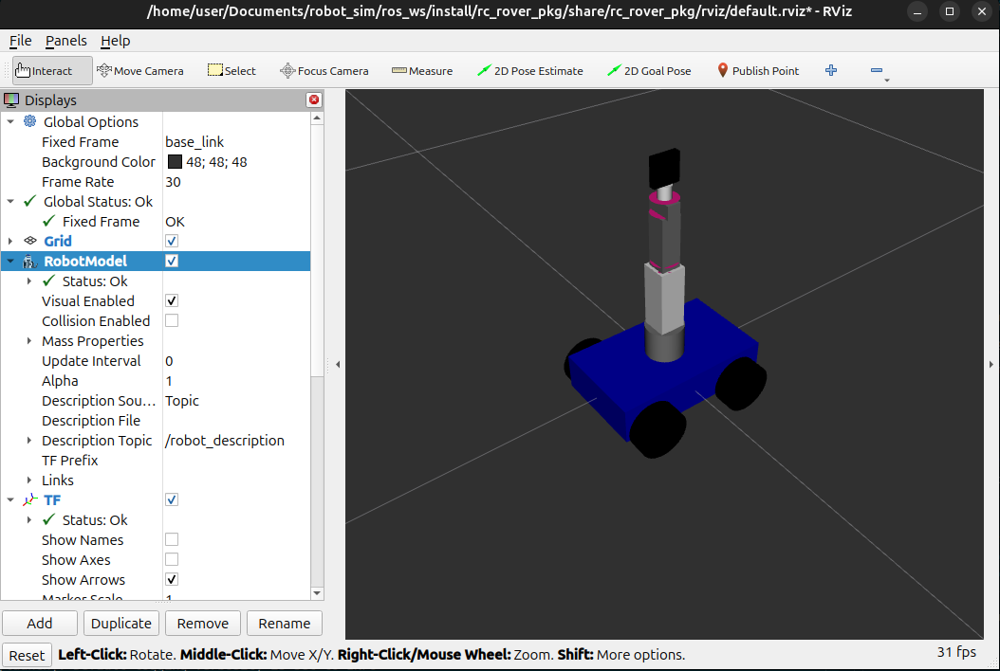

# RC Rover ROS 2 Workspace

This workspace contains the ROS 2 packages for the RC Rover project.

## Prerequisites

- ROS 2 (Humble, Iron, or Rolling recommended)
- `colcon` build tool
- Python 3

## Build Instructions

1.  Source the main ROS 2 installation:
    ```bash
    source /opt/ros/jazzy/setup.bash
    ```

2.  Navigate to the workspace directory:
    ```bash
    cd ~/Documents/robot_sim/ros_ws
    ```

3.  Build the packages:
    ```bash
    colcon build --symlink-install
    ```

3.  Source the setup script:
    ```bash
    source install/setup.bash
    ```

## Running the Robot

To launch the robot's hardware interface and state publisher, run:

```bash
ros2 launch rc_rover_pkg bringup.launch.py serial_port:=/dev/ttyUSB0
```

-   **Note**: If the Arduino is not connected to the specified `serial_port`, the node will automatically fall back to **MOCK mode**, allowing you to test the system without hardware.

## Visualization (Rviz)

The launch file starts Rviz automatically with a pre-configured view.

To visualize the robot model, simply run the launch command mentioned above. RViz will open and display the robot model.



## Hardware Interface

The `hardware_interface` node handles communication with the robot's hardware.

-   **Arduino Firmware**: Located in `src/rc_rover_pkg/arduino/ros_arduino_driver/ros_arduino_driver.ino`. Upload this to your Arduino to enable hardware control.
-   **Serial Protocol**: The node sends commands in the format `CMD:s1,s2,s3,s4,s5,s6,m1,m2,m3,m4\n` (Servos 0-180, Motors -100 to 100).

### Simulation (Mock) Mode

If the Arduino is not connected or the serial port is invalid, the node automatically switches to **Mock Mode**.
-   In Mock Mode, the node simulates the robot's movement based on the commands received.
-   This allows you to test the entire ROS stack (Navigation, MoveIt, etc.) and visualization without physical hardware.

## Interaction

The robot exposes the following topics for control:

-   **`/cmd_vel`** (`geometry_msgs/msg/Twist`): Controls the base movement (Differential Drive).
    -   Linear X: Forward/Backward
    -   Angular Z: Left/Right
-   **`/joint_commands`** (`sensor_msgs/msg/JointState`): Controls the arm joints. Publish a message with `name` and `position` arrays.

The robot publishes its state to:

-   **`/joint_states`** (`sensor_msgs/msg/JointState`): Current joint positions (feedback from hardware or mock simulation).

## Testing

### Driving the Base
To drive the robot using your keyboard:

```bash
ros2 run teleop_twist_keyboard teleop_twist_keyboard
```

### Keyboard Control (Full Robot)
To control both the base and the arm using the keyboard (similar to the simulation):

```bash
ros2 run rc_rover_pkg keyboard_control
```

**Controls:**
-   **Drive**: Arrow Keys
-   **Waist**: J (Left) / L (Right)
-   **Extension (IK)**: I (Out) / K (In)
-   **Height (IK)**: P (Up) / ; (Down)
-   **Wrist Pitch (IK)**: Z (Up) / H (Down)
-   **Wrist Roll**: U / O
-   **Gripper**: M (Open/Close) / , (Reverse)
-   **Locked Mode**: . (Toggle)

### Mock Mode Examples

Since you are likely running in Mock Mode (no hardware), here are some specific examples to try:

**1. Drive in a Circle:**
Open a new terminal and run:
```bash
ros2 topic pub --once /cmd_vel geometry_msgs/msg/Twist "{linear: {x: 0.2}, angular: {z: 0.5}}"
```
You should see the robot's wheels spinning and the base moving in a circle in RViz.

**2. Wave the Arm:**
Move the shoulder and elbow to a "wave" position:
```bash
ros2 topic pub --once /joint_commands sensor_msgs/msg/JointState "{name: ['shoulder_joint', 'elbow_joint'], position: [-0.5, 1.0]}"
```

**3. Open/Close Gripper:**
Open:
```bash
ros2 topic pub --once /joint_commands sensor_msgs/msg/JointState "{name: ['gripper_joint'], position: [0.02]}"
```
Close:
```bash
ros2 topic pub --once /joint_commands sensor_msgs/msg/JointState "{name: ['gripper_joint'], position: [0.0]}"
```

**4. Reset Arm:**
Return all joints to zero:
```bash
ros2 topic pub --once /joint_commands sensor_msgs/msg/JointState "{name: ['waist_joint', 'shoulder_joint', 'elbow_joint', 'wrist_pitch_joint', 'wrist_roll_joint', 'gripper_joint'], position: [0.0, 0.0, 0.0, 0.0, 0.0, 0.0]}"
```
